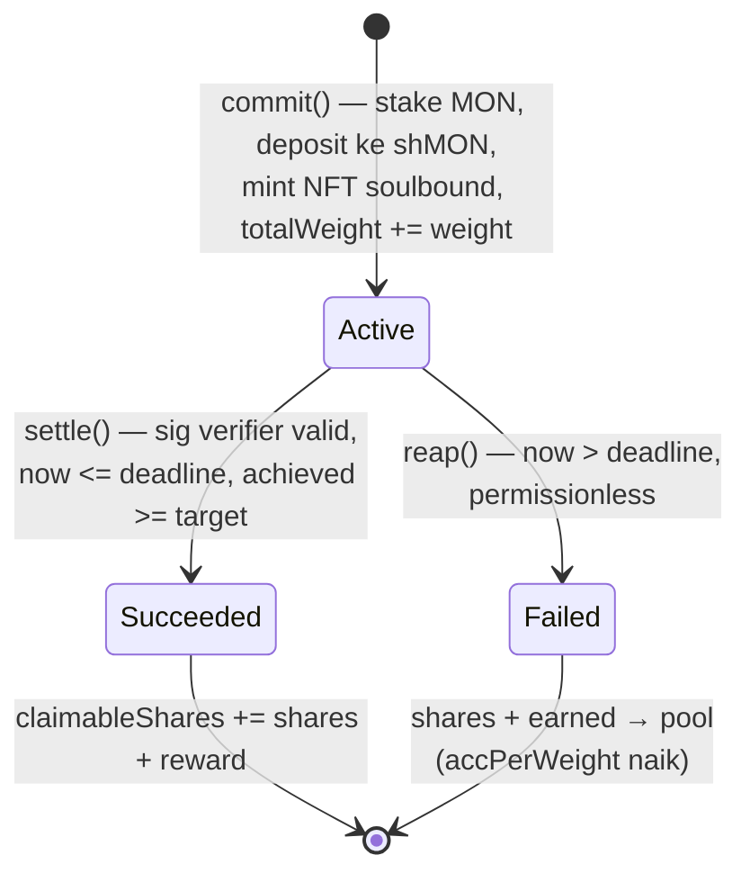
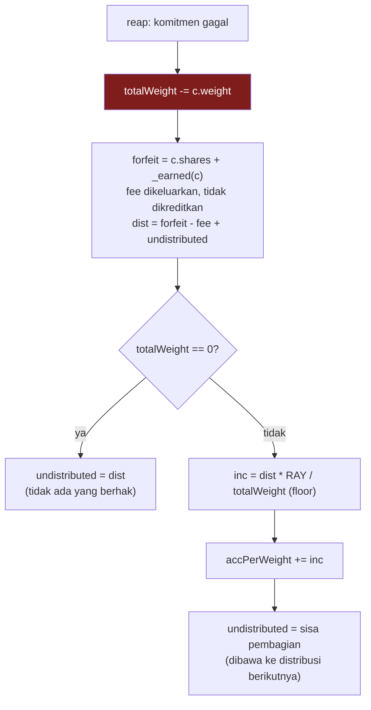
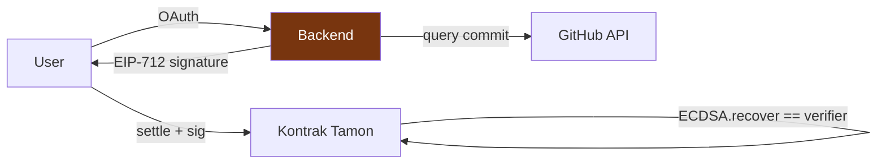

# feat: Tamon — Commitment Staking + Dynamic Stone NFT - Plan

> **Dokumen ini adalah catatan keputusan dari sebelum implementasi, dan sengaja dibiarkan apa adanya.**
> Untuk path, alamat, rute, palet, dan perilaku yang sebenarnya, baca **[`docs/as-built.md`](../as-built.md)**.
>
> Yang berbeda dari rencana ini: rute (`/` jadi landing, dashboard pindah ke `/app`), path file
> (`frontend/src/…`, bukan `frontend/…`), palet (aset on-chain ditulis lebih dulu dan menang),
> plus landing page, React Bits, GSAP, dan pengelompokan dashboard yang tidak ada di rencana awal.

## Goal Capsule

**Objective.** Developer mempertaruhkan MON pada target ngoding yang diverifikasi lewat GitHub. Stake diparkir di shMON sehingga menghasilkan yield; berhasil → modal + yield + bagian stake yang hangus; gagal → stake mengalir ke pool pemenang. Tiap komitmen adalah NFT "batu" yang melapuk secara visual seiring mendekati deadline, dirender penuh on-chain.

**Product authority.** Pemilik repo. Product Contract lengkap ada di `docs/brainstorms/2026-07-18-tamon-commitment-staking-requirements.md`.

**Product Contract preservation.** Tidak berubah. Semua requirement R1–R7 dan batas lingkup dibawa apa adanya; perencanaan hanya menambahkan lapisan HOW.

**Deadline keras.** 19 Juli 2026, 23:59 UTC. Ini membentuk setiap keputusan sequencing di bawah.

---

## Problem Frame

Aplikasi to-do tidak mengubah perilaku karena mencentang kotak tidak menimbulkan biaya. Commitment contract yang ada membuktikan taruhan uang berhasil, tetapi dananya menganggur selama periode komitmen dan verifikasinya bertumpu pada laporan mandiri.

Tamon memperbaiki keduanya: dana masuk liquid staking (menghasilkan yield alih-alih diam), dan penyelesaian ditentukan data GitHub yang objektif alih-alih klaim pribadi.

**Bukan** to-do app umum. Kalau task tidak bisa diverifikasi mesin, produk ini menolaknya — menerima klaim mandiri akan meruntuhkan premisnya.

**Tiga lapisannya adalah satu ide, bukan tiga fitur.** Uang yang dipertaruhkan harus tetap bekerja (shMON), konsekuensi harus objektif (GitHub), dan konsekuensi harus **terasa sebelum deadline tiba** — itulah batunya. Batu yang melapuk adalah satu-satunya bagian sistem yang berbicara kepada Anda saat Anda menunda. Kalimat ini harus muncul di README dan pembuka video sebelum mekanisme apa pun dijelaskan; tanpa itu, juri yang menilai "elegant" akan menyimpulkan tiga lapisan terpisah alih-alih satu argumen.

Batas kejujuran yang harus dinyatakan, bukan disembunyikan: di testnet, artefak ini mendemonstrasikan **kebenaran mekanisme** (settlement, penyaluran stake hangus, solvency) — bukan perubahan perilaku. MON faucet tidak membawa konsekuensi nyata. Verifikasi juga bukan "objektif" secara mutlak: *settlement* bersifat trustless, sementara *verifikasi* didelegasikan ke satu attester yang terikat pada sumber data publik.

---

## Requirements Trace

| ID | Requirement | Unit |
|---|---|---|
| R1 | Buat komitmen: repo, target, durasi menit–minggu | U3, U10 |
| R2 | Stake menghasilkan yield lewat shMON | U1, U2, U3 |
| R3 | Verifikasi objektif lewat GitHub, kepercayaan dinyatakan jujur | U4, U9, U10 |
| R4 | Kegagalan membiayai keberhasilan, adil terlepas urutan klaim | U2, U4, U5 |
| R5 | NFT berubah tanpa transaksi, murni fungsi waktu | U7, U10 |
| R6 | Badge akumulatif dari jumlah task berhasil | U7 |
| R7 | Dana tidak boleh terkunci permanen | U5, U6 |

---

## Key Technical Decisions

### KTD1 — Prize pool memakai accumulator, bukan epoch

Desain epoch (`slashedPool[E] * myWeight[E] / totalWeight[E]`) **ditolak karena cacat, bukan sekadar rumit.** `reap` permissionless bisa dipanggil kapan saja setelah deadline, sehingga harus dipilih epoch penampung:

- Assign berdasarkan epoch deadline → dana masuk ke epoch yang sudah tutup dan klaimnya sudah berjalan. Entah insolven (total klaim melebihi pool) atau dana nyangkut permanen.
- Assign berdasarkan waktu reap → reaper memilih epoch. Pemegang bobot besar akan reap tepat saat bagiannya maksimal, dan menahan reap saat bagiannya kecil. Ini permainan rasional, bukan serangan eksotis.

Tidak ada opsi ketiga; ini melekat pada upaya membagi aliran event permissionless yang kontinu ke dalam jendela diskret. Ditambah `totalWeight[E] == 0` (epoch dengan kegagalan tanpa keberhasilan — kasus yang wajar) butuh rollover malas dengan loop tak terbatas.

**Diganti dengan cumulative reward-per-weight index** (pola MasterChef): dua variabel global, satu field per komitmen, tanpa epoch, tanpa loop, tanpa cursor. Solvent secara konstruksi karena semua pembagian floor memihak kontrak; urutan klaim tidak berpengaruh; tidak ada dana nyangkut karena sisa dibawa di `undistributed`.

### KTD2 — Denominasi dalam shares, tidak pernah dalam MON

Nilai tukar shMON adalah **11.73 dan naik tiap blok**. Menyimpan jumlah MON berarti harus snapshot rate dan merekonsiliasi drift. Menyimpan shares berarti yield otomatis mengikuti pemegangnya tanpa kode apa pun. Semua state — bobot, pool, saldo klaim — dalam shares.

### KTD3 — Settlement dipisah dari exit

`settle` dan `reap` **murni akuntansi storage dan tidak pernah memanggil shMON**, sehingga tidak mungkin revert karena likuiditas vault. `withdraw` terpisah melakukan redeem dengan clamp ke `maxRedeem`. Ini yang membuat R7 dapat dijamin: hak pemenang tercatat permanen saat menang, terlepas dari kondisi vault saat itu.

`maxRedeem` adalah **plafon global (~15.3 shMON), bukan per-user**. Clamp (bukan revert) menjamin kemajuan: user menarik sebanyak yang vault izinkan, sisanya tetap claimable.

### KTD4 — `exitInKind` sebagai jalur keluar terakhir

Transfer shMON mentah ke user. Ini pembeda antara "dana sementara tidak likuid" dan "dana terkunci permanen". Di skala demo plafon tidak akan tersentuh, tapi ini jawaban untuk pertanyaan tersulit yang akan diajukan juri.

### KTD5 — Nama repo divalidasi saat commit, bukan di-escape saat render

`repo` adalah input user yang diinterpolasi ke JSON metadata. Karakter `"`, `\`, atau newline merusak JSON — dan karena seluruh payload di-base64, kerusakannya **tidak terlihat on-chain**, hanya muncul sebagai tile kosong di marketplace. OZ tidak menyediakan helper escaping.

Validasi charset saat `commit()` (hanya `A–Z a–z 0–9 - _ . /`, panjang dibatasi) menutup ini di sumbernya dan lebih murah daripada escaping di jalur view. Aturan ini juga sudah sesuai dengan format nama repo GitHub yang sah.

### KTD6 — Double-encode base64 untuk tokenURI

SVG di-base64 lalu ditanam di JSON, JSON-nya di-base64 lagi. Menanam SVG mentah membuat karakter `"` di dalamnya menutup string JSON. Hindari bentuk `data:image/svg+xml;utf8,` — gagal di sebagian parser.

### KTD7 — Tanpa `ERC721Enumerable`

Token soulbound: kepemilikan hanya berubah saat mint. Seluruh mesin swap-and-pop milik Enumerable adalah beban mati yang dibayar tiap mint (~+50–70k gas), dan `tokenOfOwnerByIndex` memaksa frontend melakukan N+1 round trip. Diganti `mapping(address => uint256[])` append-only dengan satu getter — satu panggilan, satu SSTORE per mint.

### KTD8 — EIP-712 tanpa nonce, `msg.sender` tidak ditandatangani

`tokenId` unik global dan guard `state == Active` membuat tiap komitmen hanya bisa di-settle sekali selamanya; replay revert dengan `NotActive()`. Mapping nonce adalah SSTORE sia-sia.

`msg.sender` sengaja **tidak** ikut ditandatangani dan payout ke `ownerOf(tokenId)`. Ini membuat `settle` permissionless dan menetralkan front-running sepenuhnya: bot yang menyalin signature dari mempool hanya membayar gas untuk menguntungkan pemiliknya. Mengikat `msg.sender` justru menciptakan permukaan griefing.

### KTD9 — `ReentrancyGuardTransient`

`evm_version = "prague"` mendukung `TSTORE`/`TLOAD`, jadi varian transient tersedia dan lebih murah. Relevan di Monad, yang menagih gas atas **gas limit** dan menaikkan harga cold storage tajam (SSTORE 2100 → 8100).

`commit`, `settle`, `reap`, `withdraw`, dan `exitInKind` **semuanya** membawa modifier yang sama. Ini bukan detail: `_safeMint` di akhir `commit` memberi penyerang callback `onERC721Received` dengan `totalWeight` sudah naik dan `entryAcc` sudah ter-snapshot — tanpa guard di `reap`, seluruh rangkaian commit→reap→tangkap runtuh jadi satu transaksi atomik.

### KTD10 — Bobot hadiah berbobot waktu, bukan hanya kapital

Ditambahkan setelah review menemukan **prize sniping tanpa risiko.** Semua deadline publik on-chain. Dengan bobot murni kapital, penyerang: commit besar dengan `MIN_DURATION` 60 detik ke repo yang ia kendalikan → panggil `reap` permissionless pada korban yang sudah lewat deadline, sehingga bobot barunya menangkap bagian proporsional dari `dist` → settle target sepelenya → withdraw. Modal berisiko **60 detik** menangkap imbalan per-unit yang sama dengan modal yang terkunci 90 hari.

Ini bukan serangan eksotis; ini permainan rasional, dan ia membatalkan pernyataan ekonomi R4 secara langsung.

Perbaikannya satu field: `weight = shares * duration / MAX_DURATION` (floor, minimum 1), diset saat commit dan dipakai untuk `totalWeight`/`entryAcc`/`_earned`. `shares` tetap jadi satuan modal. Komitmen 60 detik lalu memperoleh ~1/130.000 bagian pool dibanding komitmen 90 hari berukuran sama — imbal hasil sniping jatuh jauh di bawah fee slash 10%.

Konsekuensi jujur yang harus dicatat: hadiah kini terikat **kapital × waktu**, bukan kesulitan target. Pemegang modal besar tetap memperoleh bagian lebih besar daripada pemegang modal kecil dengan target lebih berat. Distribusi berbobot kesulitan di luar anggaran v1 — nyatakan ini di README, jangan klaim "berbagi ke pengguna disiplin" tanpa kualifikasi.

---

## High-Level Technical Design

### State machine



Kedua state terminal bersifat absorbing. `claimableShares` adalah saldo level-address yang terpisah dari komitmen — inilah yang memisahkan "apakah Anda menang" dari "apakah shMON bisa membayar sekarang".

### Aliran accumulator



Kotak merah adalah urutan yang wajib. Detail di U4.

### Batas kepercayaan



Kotak oranye adalah satu-satunya komponen tepercaya. Kunci verifier yang dikompromikan bisa mencetak sukses palsu. Ini dinyatakan terbuka di README dan video demo — *trust-minimized*, bukan *trustless*.

---

## Output Structure

```
contract/
  foundry.toml
  src/
    Tamon.sol
    StoneRenderer.sol            # dipisah hanya jika bytecode mendekati batas
    interfaces/IShMON.sol        # sudah ada
  test/
    ShMONGate.t.sol              # sudah ada
    Tamon.t.sol
    TamonInvariant.t.sol
  script/
    Deploy.s.sol
backend/
  src/index.ts                   # Hono: OAuth callback + /attest
  src/github.ts
  src/sign.ts
frontend/
  app/
    page.tsx                     # create
    dashboard/page.tsx
    stone/[id]/page.tsx
  lib/{wagmi,abi}.ts
```

Struktur ini adalah deklarasi lingkup, bukan batasan. Daftar `Files` per unit yang otoritatif.

---

## Anggaran Waktu dan Checkpoint

Rencana sebelumnya memicu daftar potong dengan frasa "bila waktu habis" tanpa mendefinisikan kapan itu. Satu-satunya jam di dokumen adalah gerbang 2 jam di U1 — artinya kelebihan waktu baru ketahuan secara retrospektif, bukan di titik keputusan.

| Unit | Pekerjaan | Jam |
|---|---|---|
| U0 | Aset Tingkat 1 (palet, batu, 5 fragmen, badge) | 2 |
| U1 | Gerbang shMON (sudah ter-scaffold) | 2 |
| U2 | Storage layout | 0,5 |
| U3 | `commit()` + validasi | 1,5 |
| U4 | `settle`/`reap`/accumulator + EIP-712 | 3 |
| U6 | `withdraw` + `exitInKind` | 1 |
| U5 | Test solvency + regresi | 1,5 |
| U7 | `tokenURI` SVG | 3 |
| U8 | Deploy + verify | 1 |
| U9 | Backend attestation | 2,5 |
| U10 | Frontend | 4 |
| U11 | README + video + screenshot | 2 |
| | **Total** | **24** |

Cadangan ~5 jam dari jendela ~29 jam. Itu tipis, bukan longgar.

**Tiga checkpoint keras, terikat ke deadline:**

- **T-20 jam** — kontrak compile dan `forge test` hijau. Kalau belum: ciutkan U5 ke test regresi urutan saja, lepas harness fuzzing.
- **T-12 jam** — ter-deploy dan terverifikasi. Kalau belum: mulai potong sesuai daftar, dari butir 1.
- **T-5 jam** — **berhenti ngoding dan rekam video, apa pun keadaannya.** Submission tanpa video adalah nol; kontrak yang 10% lebih baik tidak.

### U0. Aset visual Tingkat 1

**Goal.** Menghasilkan string SVG yang siap ditempel, sebelum U7 membutuhkannya.

**Requirements.** R5, R6.

**Dependencies.** Tidak ada. **Kerjakan paralel dengan menunggu fork test U1** — U1 sebagian besar adalah waktu tunggu jaringan.

**Files.** `docs/assets.md` (spesifikasi, sudah ada) → keluaran berupa literal string Solidity.

**Approach.** Ikuti urutan di `docs/assets.md`: A4 palet → A1 batu dasar → A2 lima fragmen → A3 badge. Anggaran karakter ada di sana. **Larangan generator retakan parametrik berlaku di sini**, bukan di U7 — kalau geometrinya dibuat parametrik saat ini, U7 akan mewarisi masalahnya.

**Verification.** Letakkan kelima state berdampingan pada 64px. Kalau "lapuk" dan "retak" tidak bisa dibedakan sekilas, progresinya gagal — dan progresi itulah yang dilihat juri di video. **Kalau uji ini gagal, remedinya: tebalkan garis retakan dan gelapkan warnanya, jangan tambah jumlah garis.**

**Test expectation: none** — aset, bukan kode.

---

### U1. Scaffold kontrak dan gerbang shMON

**Goal.** Membuktikan shMON benar-benar berfungsi sebelum satu baris pun logika Tamon ditulis.

**Requirements.** R2.

**Dependencies.** Tidak ada. Unit pertama.

**Files.**
- `contract/foundry.toml` (sudah ada — solc 0.8.28, `evm_version = "prague"`)
- `contract/src/interfaces/IShMON.sol` (sudah ada)
- `contract/test/ShMONGate.t.sol` (sudah ada)

**Approach.** Fork test terhadap Monad testnet. Verifikasi: kontrak punya code, `asset()` mengembalikan sentinel native, rate jauh di atas 1:1, round trip deposit→redeem, deposit dengan `value: 0` revert, dan rate naik setelah blok berlalu.

**Test scenarios.**
- shMON hidup dan `asset()` == `0xEeee…EEeE`.
- `convertToAssets(1e18)` > 5e18 — menangkap regresi jika rate runtuh atau address salah.
- Deposit 1 MON → shares > 0, dan **shares < stake/5** (menangkap asumsi 1:1 yang keliru).
- `previewDeposit` sepakat dengan `deposit`.
- Redeem penuh → MON kembali, saldo shares nol, kehilangan round trip < 1%.
- Deposit dengan `value: 0` revert.
- Setelah `vm.rollFork(+5000)`, rate naik.

**Verification.** `forge test --fork-url https://testnet-rpc.monad.xyz --match-contract ShMONGate` hijau semua.

> **GERBANG.** Jika unit ini tidak hijau dalam 2 jam, potong integrasi staking: simpan MON mentah di escrow, R2 gugur, sisa rencana tetap utuh dan tetap layak disubmit. Keputusan ini diambil di jam ke-2, bukan jam ke-25.

---

### U2. Storage layout dan konstanta

**Goal.** Menetapkan bentuk state sekali, benar, sebelum ada logika yang bergantung padanya.

**Requirements.** R2, R4.

**Dependencies.** U1.

**Files.** `contract/src/Tamon.sol`

**Approach.**

```
enum State { None, Active, Succeeded, Failed }

struct Commitment {
    uint128 shares;      // shares shMON — modal. BUKAN jumlah MON.
    uint128 weight;      // shares * duration / MAX_DURATION — bobot hadiah (KTD10)
    uint64  start;
    uint64  deadline;
    uint256 entryAcc;    // snapshot accPerWeight saat dibuat
    uint32  target;
    uint32  achieved;    // diisi saat settle dari payload EIP-712
    State   state;
    string  repo;        // charset tervalidasi (KTD5)
}
```

Global: `accPerWeight`, `totalWeight`, `undistributed`, `nextId` (mulai 1), `verifier`.
Mapping: `commitments`, `claimableShares`, `completedCount`, `ownedTokens` (KTD7).
Konstanta: `RAY = 1e27`, `MIN_STAKE = 0.1 ether`, `MIN_TARGET = 1`, `MIN_DURATION = 60`, `MAX_DURATION = 90 days`, `SLASH_FEE_BPS = 1000`, `MAX_REPO_LEN = 100`.

**`shares` dan `weight` adalah dua hal berbeda dan tidak boleh tertukar.** `shares` adalah modal — dipakai untuk `claimableShares` dan jumlah yang hangus. `weight` adalah hak atas hadiah — dipakai untuk `totalWeight`, `entryAcc`, dan `_earned`. Alasannya di KTD10.

**Tidak ada `treasury`.** Dihapus setelah review: mengirim 10% tiap stake yang hangus ke alamat yang dikendalikan pengembang secara struktural adalah rake bandar, dan brainstorm menaruh judi di luar identitas produk dengan alasan spesifik — *"stake hangus mengalir ke pengguna disiplin lain, bukan ke bandar."* Efek jera self-dealing tidak berubah bila fee sekadar dikeluarkan dari `dist` dan dibiarkan tak terdistribusi selamanya: fee tetap tak bisa diambil siapa pun, invariant `>=` tetap berlaku, dan optik rake hilang.

`repo` sengaja `string` bukan `bytes32` — memotong ke 32 byte diam-diam merusak nama repo yang sah, dan SVG perlu merendernya.

Presisi: shares ~1e17, `shares * accDelta` ≈ 1e48, tiga orde di bawah batas uint256.

**Patterns to follow.** OZ v5.1: `Ownable(initialOwner)` wajib argumen; `ReentrancyGuardTransient` dari `@openzeppelin/contracts/utils/`.

**Test expectation: none** — unit deklaratif murni, diuji lewat unit yang memakainya.

---

### U3. `commit()` — stake, deposit, mint

**Goal.** User mempertaruhkan MON, dana masuk shMON, NFT ter-mint.

**Requirements.** R1, R2.

**Dependencies.** U2.

**Files.** `contract/src/Tamon.sol`, `contract/test/Tamon.t.sol`

**Approach.** Validasi `msg.value >= MIN_STAKE`, `duration` dalam rentang, dan **`target >= MIN_TARGET`**.

Validasi `target` bukan formalitas: tanpa lantai, `target = 0` dengan durasi 60 detik adalah kemenangan gratis — backend menandatangani karena `achieved >= target` terpenuhi oleh nol commit, dan `settle` membayar modal + yield + bagian hadiah penuh untuk tidak melakukan apa pun. Itu produk komitmen yang komitmennya opsional, persis bentuk "fitur palsu" yang juri diminta menghukum. Cerminkan lantai yang sama di U9 agar backend menolak menandatangani.

**Validasi struktur `repo`** — bukan sekadar charset. Selain `A–Z a–z 0–9 - _ . /` dan panjang ≤ `MAX_REPO_LEN`: wajib **tepat satu** `/`, kedua segmen tidak kosong, dan tidak ada segmen yang sama dengan `.` atau `..`. Charset saja meloloskan `victim/repo/../../../repos/attacker/loaded`, yang tersimpan on-chain lalu mengalir apa adanya ke path GitHub API di U9 — mengalihkan query attestation ke endpoint sembarang. KTD5 dirancang untuk keamanan JSON; ini lubang kedua di string yang sama.

Deposit ke shMON meneruskan `msg.value` di kedua posisi (assets dan `msg.value`) karena ERC-7535 mensyaratkan keduanya sama. Ambil shares dari nilai kembalian. Hitung `weight = shares * duration / MAX_DURATION` (floor, minimum 1). Tulis struct dengan `entryAcc = accPerWeight`. Naikkan `totalWeight` sebesar `weight`. Push ke `ownedTokens`. `_safeMint` **paling akhir**, setelah semua penulisan state.

**Execution note.** Tulis test validasi `repo` lebih dulu — ini jalur yang paling mudah terlewat dan konsekuensinya senyap.

**Test scenarios.**
- Commit 1 MON → shares > 0, `totalWeight` naik sebesar shares, NFT ter-mint ke `msg.sender`, `entryAcc` == `accPerWeight` saat itu.
- Stake di bawah `MIN_STAKE` revert.
- `duration` < 60 detik revert; > 90 hari revert.
- `repo` berisi `"` revert. Juga uji `\`, newline, spasi, dan string kosong.
- `repo` melebihi `MAX_REPO_LEN` revert.
- `repo` sah `"user/my-repo.js"` diterima.
- `repo = "a/../../b"` revert; `repo` tanpa `/` revert; `repo` dengan dua `/` revert.
- `target = 0` revert.
- Komitmen 60 detik dan komitmen 90 hari dengan stake sama → `weight` yang kedua ~130.000× lebih besar (regresi KTD10).
- Dua commit berturut-turut mendapat `tokenId` berbeda dan keduanya masuk `ownedTokens`.
- `commit` dengan `msg.value == 0` revert.

**Verification.** Commit berhasil menaikkan saldo shMON kontrak; `totalWeight` sama dengan jumlah shares seluruh komitmen aktif.

---

### U4. `settle()`, `reap()`, dan accumulator

**Goal.** Inti ekonomi. Keberhasilan mengambil modal + yield + hadiah; kegagalan mendanai pool.

**Requirements.** R3, R4.

**Dependencies.** U3.

**Files.** `contract/src/Tamon.sol`, `contract/test/Tamon.t.sol`

**Approach.**

`_earned(c)` = `c.weight * (accPerWeight - c.entryAcc) / RAY`, floor. **Perhatikan `weight`, bukan `shares`** (KTD10).

**Struct EIP-712 — tulis persis ini, jangan diserahkan ke inferensi:**

```
Attestation(uint256 tokenId,address owner,uint32 achieved,uint64 expiry)
```

`owner` diikat ke `ownerOf(tokenId)` saat penandatanganan. `settle` menghitung ulang digest dari `tokenId` dan `ownerOf(tokenId)` **on-chain**, bukan dari calldata. Tanpa `tokenId` di dalam struct, klaim KTD8 bahwa replay tertutup **tidak berlaku**: guard `state == Active` hanya mencegah token yang sama di-settle dua kali, dan satu attestation sah akan menyelesaikan setiap komitmen milik siapa pun selama 10 menit.

`achieved` tiba sebagai field payload yang ditandatangani, bukan dibaca dari storage. `settle` menulis `c.achieved = achieved` sebagai bagian dari penulisan state terminal, lalu membandingkan terhadap `c.target`.

`settle`: guard `state == Active`, `now <= deadline`, `now <= expiry`, `achieved >= target`, `ECDSA.recover(digest, sig) == verifier`. Hitung reward, kurangi `totalWeight` sebesar `c.weight`, tulis state terminal, `claimableShares[ownerOf] += shares + reward`, `completedCount++`, emit `MetadataUpdate`.

`reap`: guard `state == Active` dan `now > deadline`. Lalu, **dalam urutan ini**:

1. `totalWeight -= c.weight`
2. `forfeit = c.shares + _earned(c)`
3. `fee = forfeit * SLASH_FEE_BPS / 10_000` — **dikeluarkan dari `dist` dan tidak dikreditkan ke mana pun.** Tidak ada penerima; fee menjadi shares yang terkunci permanen di kontrak. Ini disengaja (lihat U2): efek jeranya identik dengan rake, tanpa ada bandar.
4. `dist = forfeit - fee + undistributed`
5. Jika `totalWeight == 0` → `undistributed = dist`; selain itu `inc = dist * RAY / totalWeight`, `accPerWeight += inc`, `undistributed = dist - (inc * totalWeight) / RAY`

**Langkah 1 wajib mendahului langkah 5.** Jika terbalik, komitmen yang gagal ikut menerima bagian dari hangusnya sendiri dan accumulator menjanjikan lebih dari yang dipegang kontrak. Kegagalannya **senyap** — tidak ada yang revert sampai suatu hari ada user yang tidak bisa withdraw. Ini kandidat bug paling mahal di seluruh rencana; **U4 menulis test regresi khusus untuknya (lihat Test scenarios di bawah), sebelum `reap` ditulis.**

Pembulatan: **tidak ada satu pun tempat di desain ini yang benar untuk round up.** Semua floor, sisa dibawa di `undistributed`.

**Execution note.** Test-first untuk `reap`. Tulis test regresi urutan sebelum menulis `reap`.

**Test scenarios.**
- Settle dengan signature sah sebelum deadline → state `Succeeded`, `claimableShares` naik, `completedCount` naik.
- Settle dengan `achieved < target` revert.
- Settle 1 detik setelah deadline revert.
- Settle dengan signature dari kunci yang salah revert.
- Settle dengan `expiry` yang sudah lewat revert.
- Settle dua kali revert `NotActive` (replay tertutup tanpa nonce).
- Settle dipanggil alamat lain dengan signature sah → berhasil, dan payout tetap ke `ownerOf` (front-running netral).
- Reap sebelum deadline revert.
- Reap setelah deadline → state `Failed`, `accPerWeight` naik, dan `dist` yang terdistribusi tepat `forfeit - fee` (fee tidak sampai ke siapa pun).
- **Regresi urutan:** tiga komitmen aktif, satu gagal → yang gagal menerima **nol** dari hangusnya sendiri; dua yang tersisa berbagi tepat `dist`.
- **Regresi replay lintas-token:** signature yang diterbitkan untuk token A revert saat dikirim terhadap token B.
- **Regresi sniping (KTD10):** komitmen 60 detik dan komitmen 30 hari berstake sama, keduanya aktif saat sebuah reap terjadi → bagian hadiah yang 60 detik dapat harus dapat diabaikan dibanding yang 30 hari.
- Reap saat tidak ada komitmen aktif lain → seluruh `dist` masuk `undistributed`, `accPerWeight` tidak berubah, tidak ada pembagian dengan nol.
- `undistributed` yang tertahan ikut terdistribusi pada reap berikutnya saat ada bobot aktif.
- Reap dua kali revert.

**Verification.** Setelah rangkaian commit/settle/reap apa pun, saldo shMON kontrak ≥ total kewajiban.

---

### U5. Test invariant solvency

**Goal.** Membuktikan kontrak tidak pernah bisa berutang lebih dari yang dipegangnya.

**Requirements.** R4, R7.

**Dependencies.** U4, U6. Handler memanggil `withdraw`, yang baru ada di U6 — dua dari tiga skenario di bawah bergantung padanya, jadi U5 dijalankan setelah U6.

**Files.** `contract/test/TamonInvariant.t.sol`

**Approach.** Invariant:

```
shMON.balanceOf(tamon) >= Σ_active c.shares          // modal komitmen aktif
                        + Σ claimableShares          // sudah settle, belum ditarik
                        + undistributed              // menunggu distribusi
                        + Σ_active c.weight * (accPerWeight - c.entryAcc) / RAY
```

**`totalWeight` sengaja TIDAK muncul di sini.** Setelah KTD10, `totalWeight` adalah jumlah bobot (kapital × waktu), bukan kuantitas shares — memasukkannya akan mencampur dua satuan dan menghasilkan invariant yang tidak bermakna. Yang menjadi kewajiban dalam shares adalah modal komitmen aktif, dan itu dijumlahkan terpisah. Handler test mengiterasi komitmen aktif untuk menghitung dua suku `Σ_active`.

Berlaku dengan `>=` bukan `==` karena semua pembagian floor memihak kontrak; dust menumpuk dan tidak berbahaya — termasuk fee slash yang sengaja tidak dikreditkan ke siapa pun.

Handler melakukan commit/settle/reap/withdraw dalam urutan acak dengan aktor dan jumlah bervariasi.

**Test scenarios.**
- Invariant bertahan di seluruh urutan acak.
- Invariant bertahan pada kasus batas: semua gagal; semua berhasil; berselang-seling; `totalWeight` mencapai nol lalu naik lagi.
- Setelah semua pihak withdraw sepenuhnya, sisa saldo kontrak hanya dust (bukan negatif, bukan besar).

**Verification.** `forge test --match-contract TamonInvariant` hijau.

---

### U6. `withdraw()` dan `exitInKind()`

**Goal.** Menjamin R7 — dana tidak pernah terkunci permanen.

**Requirements.** R7.

**Dependencies.** U4.

**Files.** `contract/src/Tamon.sol`, `contract/test/Tamon.t.sol`

**Approach.** `withdraw`: `amt = min(requested, claimableShares[msg.sender], shMON.maxRedeem(address(this)))`. Revert hanya bila `amt == 0`. Kurangi `claimableShares` **sebelum** panggilan eksternal (CEI), lalu `redeem(amt, msg.sender, address(this))` — native MON mendarat langsung di user, bukan di kontrak.

Kontrak **tidak memiliki `receive()`**. Ini disengaja: `receiver` selalu `msg.sender`, tidak pernah `address(this)`, sehingga kontrak tidak perlu menerima native — sekaligus memblokir donasi tak sengaja yang akan mengacaukan invariant.

`exitInKind`: transfer shMON mentah setelah mendebit. Lima baris, dan satu-satunya jawaban memadai jika kapasitas redeem vault habis.

View `withdrawableNow(user)` = `min(claimable, maxRedeem)` untuk frontend menampilkan "3.2 dari 5.0 MON tersedia sekarang".

**Test scenarios.**
- Withdraw penuh saat plafon longgar → MON tiba, `claimableShares` nol.
- Withdraw saat `maxRedeem` di bawah saldo klaim → ter-clamp, sisa tetap claimable, **tidak revert**.
- Withdraw dengan `claimableShares == 0` revert.
- Withdraw berulang menghabiskan saldo bertahap.
- `exitInKind` mentransfer shMON dan mendebit saldo dengan benar.
- Reentrancy: penerima jahat yang memanggil ulang `withdraw` gagal — dan melihat state yang sudah konsisten.
- Kontrak menolak transfer native langsung (tidak ada `receive`).

**Verification.** Tidak ada urutan yang membuat user berhak tidak bisa mengeluarkan dananya lewat salah satu dari dua jalur.

---

### U7. `tokenURI()` — SVG on-chain dan soulbound

**Goal.** Batu berubah wujud murni dari berjalannya waktu, tanpa transaksi.

**Requirements.** R5, R6.

**Dependencies.** U3, U4 (skenario di bawah butuh token `Succeeded` dan `Failed`, yang hanya U4 bisa hasilkan), **plus aset Tingkat 1 dari `docs/assets.md`** — A4 palet → A1 batu dasar → A2 lima fragmen → A3 badge. Keempatnya dikerjakan tangan dan **U7 tidak bisa dimulai sebelum semuanya final.** Kerjakan saat menunggu fork test U1.

**Files.** `contract/src/Tamon.sol` (atau `contract/src/StoneRenderer.sol` bila perlu dipisah), `contract/test/Tamon.t.sol`. Sumber string SVG: `docs/assets.md`.

**Approach.**

```
elapsed = (now - start) * 100 / (deadline - start)
Failed              → hancur
Succeeded           → kristal
Active, elapsed <50 → utuh
Active, 50–80       → lapuk
Active, >=80        → retak
```

Badge dari `completedCount[ownerOf]`: 0 none, 1–2 perunggu, 3–5 perak, 6+ emas — dirender ke SVG yang sama, bukan kontrak kedua.

**Satu `<path>` batu dasar + lima fragmen overlay hardcoded** dipilih lewat satu rantai `if/else`. **Jangan bangun generator retakan parametrik.** Ini item yang paling mungkin memakan 8 jam dari anggaran 3 jam; batasi ke fragmen tetap.

Double-encode base64 (KTD6). `repo` sudah tervalidasi di U3, jadi aman diinterpolasi.

Soulbound — panggil `super._update` dulu untuk memperoleh `from`:

```
address from = super._update(to, tokenId, auth);
if (from != address(0) && to != address(0)) revert SoulboundTransferDisabled();
return from;
```

Emit `MetadataUpdate` pada `settle`/`reap`. ERC-4906 interface id `0x49064906` **tidak** didaftarkan otomatis oleh OZ — tambahkan sendiri ke `supportsInterface`.

**Test scenarios.**
- `tokenURI` diawali `data:application/json;base64,`.
- Payload yang di-decode adalah JSON sah dengan field `name`, `description`, `image`.
- `image` diawali `data:image/svg+xml;base64,` dan SVG hasil decode punya tag pembuka/penutup berpasangan.
- Kelima state merender penanda berbeda: majukan waktu melewati 50% dan 80%, verifikasi output berubah **tanpa transaksi apa pun**.
- Token `Succeeded` merender kristal; `Failed` merender hancur.
- Tier badge berubah seiring `completedCount` melewati 1, 3, dan 6.
- Transfer revert `SoulboundTransferDisabled`; mint dan burn tetap jalan.
- `supportsInterface(0x49064906)` true.
- `tokenURI` untuk token yang tidak ada revert.
- Nama repo terpanjang yang sah tetap menghasilkan JSON sah (regresi KTD5).

**Verification.** `forge build --sizes` di bawah batas Monad 128KB. Decode `tokenURI` di test dan parse hasilnya — jangan hanya cek panjang string.

---

### U8. Deploy dan verify di Monad testnet

**Goal.** Contract address on-chain. **Wajib untuk submission.**

**Requirements.** Semua.

**Dependencies.** U4, U6, U7.

**Files.** `contract/script/Deploy.s.sol`

**Approach.** Deploy ke chain 10143 dengan alamat shMON, verifier, dan `initialOwner` sebagai parameter konstruktor (OZ v5 mewajibkan `Ownable(initialOwner)`). Verify di `testnet.monadvision.com`.

**Deploy instance sementara segera setelah U4 dan U7 compile** — sebelum U5 dan U6 selesai — semata untuk membuka blokir U9/U10 terhadap alamat dan ABI yang hidup. Perlakukan deploy final sebagai penukaran konfigurasi: backend membaca `VERIFYING_CONTRACT` dan frontend membaca `NEXT_PUBLIC_TAMON_ADDRESS` dari env, **tidak pernah konstanta hardcoded**, sehingga redeploy berbiaya satu perubahan env plus verify ulang, bukan perubahan kode. Redeploy setelah U9 ditulis akan membatalkan setiap signature yang diproduksi backend — kegagalan yang muncul sebagai "settle selalu revert" di bawah tekanan demo.

Catatan gas Monad: ditagih atas **gas limit, bukan gas used**. Jangan over-estimate.

**Test scenarios.** Post-deploy smoke on-chain, tiga langkah:

1. Satu commit dengan deadline 5 menit; konfirmasi NFT ter-mint dan `tokenURI` merender.
2. **Buka satu komitmen yield berdurasi panjang (~20 jam) segera setelah deploy.** Pada ~110% APY, stake 1 MON selama 5 menit menghasilkan ~0,00001 MON — akan terender `0.0000` di UI mana pun. DoD dan naskah video sama-sama menuntut angka yield terlihat, jadi klaim itu tidak bisa dipenuhi oleh batu 5 menit. Komitmen panjang ini yang menunjukkan delta yield di menit 1:30–2:20 video; batu 5 menit menunjukkan siklus hidup dan pembayaran pool.
3. **Baca `shMON.maxRedeem(address(this))` langsung sebelum merekam.** Plafon ~15,3 shMON itu global dan dipakai bersama setiap pengguna shMON lain di testnet — penebusan pihak lain bisa menghabiskannya di antara smoke test dan pengambilan gambar. Ukur semua stake demo agar total claimable tetap di bawah seperempat headroom yang teramati.

**Verification.** Address terverifikasi dan bisa dibuka publik di explorer. Catat address-nya di README.

---

### U9. Backend attestation GitHub

**Goal.** Jembatan dari data GitHub off-chain ke signature yang bisa diverifikasi kontrak.

**Requirements.** R3.

**Dependencies.** U4 (bentuk struct saja). **Bukan U8.** Alamat kontrak disuntik sebagai env var, bukan dependensi build — mengunci U9 di belakang deploy akan menyerialkan ~6,5 jam pekerjaan backend dan frontend di belakang kontrak final, tanpa anggaran untuk redeploy. Bangun dan uji terhadap instance lokal dari `forge script` di anvil, tukar `verifyingContract` setelah U8.

**Files.** `backend/src/index.ts`, `backend/src/github.ts`, `backend/src/sign.ts`, `backend/src/auth.ts`

**Approach.**

**Scaffold dulu:** `backend/` masih kosong. pnpm + Hono + viem, daftarkan GitHub OAuth app terhadap domain frontend final, deploy ke URL publik **sebelum** menulis `/attest` — URL callback harus ditetapkan sekali, bukan dua kali.

**Pengikatan identitas — ini titik di mana R3 hidup atau mati.** Tanpa penyimpanan, `/attest` tidak punya cara mengetahui akun GitHub mana yang terikat ke wallet pemanggil, dan pemeriksaan "repo milik user lain → ditolak" akan ditegakkan terhadap data yang dikendalikan penyerang. Callback OAuth menerbitkan JWT bertanda tangan berisi `{githubLogin, wallet}` — wallet dibuktikan lewat `personal_sign` gaya SIWE saat connect. Tidak ada state di server. `/attest` mewajibkan JWT itu, dan `repo` yang di-query dibaca dari `commitments[tokenId].repo` **on-chain**, tidak pernah dari body request.

**Definisi commit yang dihitung** — persempit dan nyatakan di README: commit di branch default repo, ditulis oleh login yang terikat OAuth, **dengan diff tidak kosong** (`stats.total > 0` dari endpoint detail commit), dihitung memakai timestamp push GitHub, bukan tanggal commit yang disuplai penulis. Tanpa syarat non-kosong, `git commit --allow-empty` dalam loop memenuhi target apa pun dalam dua detik — dan `GIT_AUTHOR_DATE` sepenuhnya dikendalikan penyerang, jadi filter timestamp apa pun bersifat anjuran belaka.

Cerminkan `MIN_TARGET` di sisi server: tolak menandatangani untuk komitmen yang target-nya di bawah lantai.

**Kustodi kunci verifier.** Dimuat dari `VERIFIER_PRIVATE_KEY` di secret store platform saja. `.env` masuk gitignore; tidak ada `.env.example` yang memuat kunci asli; backend tidak pernah mencatat body request atau material penandatanganan; verifier yang ter-deploy adalah kunci sekali pakai yang tidak memegang dana. Ini repo yang akan dipublikasikan untuk dinilai — realisasi paling mungkin dari risiko yang sudah diterima ini adalah kunci mendarat di riwayat git.

Sertakan **SHA commit kepala** yang dihitung backend ke dalam struct EIP-712, simpan saat settle, dan render di stone view sebagai tautan ke `github.com/{repo}/commits/{sha}`. Tanpa ini, juri melihat centang hijau yang asal-usulnya murni klaim — sistem yang jujur jadi tidak bisa dibedakan dari `return true` yang di-hardcode.

Domain: `EIP712("Tamon", "1")`, chainId 10143, `verifyingContract` = alamat kontrak.

**Test scenarios.**
- Target terpenuhi → mengembalikan signature sah yang diterima kontrak.
- Target tidak terpenuhi → menolak menandatangani.
- Repo milik user lain → ditolak.
- Signature yang dihasilkan ter-recover ke alamat verifier yang benar (uji silang terhadap kontrak).
- `expiry` benar-benar 10 menit ke depan.

**Verification.** Signature dari backend berhasil di-settle di kontrak yang sudah ter-deploy.

---

### U10. Frontend

**Goal.** Tiga layar yang membuat siklus hidup terlihat dalam demo 3 menit.

**Requirements.** R1, R5, R6.

**Dependencies.** U8, U9.

**Files.** `frontend/app/page.tsx`, `frontend/app/dashboard/page.tsx`, `frontend/app/stone/[id]/page.tsx`, `frontend/lib/wagmi.ts`, `frontend/lib/abi.ts`

**Approach.**

**Scaffold dan deploy lebih dulu, sebelum menulis layar apa pun.** `pnpm create next-app` + wagmi/viem untuk chain 10143, lalu deploy ke Vercel sebagai tindakan pertama unit ini — supaya URL callback OAuth di U9 diketahui sekali dan tidak berubah.

**Mekanisme re-render — ini yang membuat klaim inti produk benar-benar sampai ke user.** `tokenURI` adalah fungsi view; tidak ada apa pun di browser yang membacanya ulang seiring waktu, jadi batu akan diam membeku sampai user hard-refresh. Gunakan `useReadContract` untuk `tokenURI` dengan `refetchInterval: 5000` di dashboard dan stone view, countdown berdetak 1 detik dari jam lokal, dan SVG hasil decode disuntik ulang tiap refetch. Perbaiki juga naskah A6 langkah 3: hapus kata "Refresh", ganti jadi *"batu melapuk lalu retak sendiri di layar, tanpa interaksi apa pun"* — rencana sebelumnya menuntut "tanpa refresh manual" di test sekaligus menginstruksikan "Refresh" di video.

**Batu tidak hancur sendiri — tangani jurang ini secara eksplisit.** `Failed` hanya tercapai lewat `reap()`, sebuah transaksi, jadi pada deadline+1 detik batu yang gagal masih merender `retak`. Momen puncak demo justru momen di mana waktu saja tidak melakukan apa-apa. Saat stone view melihat `deadline` lewat dan `state == Active`, panggil `reap(tokenId)` otomatis lewat wallet yang terhubung (fungsinya permissionless), dan render state antara yang eksplisit: countdown diganti *"Deadline lewat — menyegel…"* di atas batu `retak`, sampai transaksi terkonfirmasi dan SVG berubah jadi `hancur`. Tambahkan limbo pra-reap ini sebagai state render bernama di U7 agar `elapsed >= 100, Active` tidak diam-diam terlipat jadi `retak`.

**Layar:** dashboard adalah permukaan utama — SVG penuh 240px, nama repo, `achieved/target`, countdown, dan kata state. Dua kartu muat berdampingan di 1280px sehingga kedua cabang demo tetap satu layar. Stone view didemosikan jadi permukaan uang saja: dekomposisi modal/yield/hadiah, tombol claim dan withdraw.

**State interaksi — enam, semuanya wajib.** Tampilan pertama juri adalah dashboard tanpa wallet terhubung dan nol batu; rencana sebelumnya tidak menyebut state itu sama sekali. (1) wallet belum terhubung → satu CTA connect di atas field gelap; (2) dashboard kosong → batu utuh dirender besar + *"Belum ada batu. Buat komitmen pertama."*; (3) read pending → siluet batu opacity 30%, tanpa spinner; (4) tx pending → label tombol jadi *"Menandatangani…"* dan disabled; (5) tx ditolak → pesan inline di bawah tombol, nilai form dipertahankan; (6) chain salah → tombol *"Pindah ke Monad testnet"*.

**Stone view untuk komitmen gagal.** Tidak ada claim, tidak ada withdraw, tidak ada dekomposisi — tanpa spesifikasi, area aksi utama render kosong tepat di paruh produk yang paling bermuatan emosi, dan itu salah satu dari dua cabang yang ditelusuri video. Render: SVG hancur ukuran penuh, judul *"Hangus"*, satu baris akuntansi faktual (*"X MON diteruskan ke komitmen yang berhasil, Y MON biaya protokol"*), dan satu aksi maju *"Buat komitmen baru"* terisi otomatis dengan repo dan target yang sama. Tanpa kalimat minta maaf, tanpa framing hiburan.

**Baris kepercayaan permanen** di dashboard dan stone view: *"Verifikasi ditandatangani oleh kunci verifier Tamon — trust-minimized, bukan trustless"*, bertaut ke bagian README. Bukan footer kecil — letakkan berdampingan dengan tombol claim. R3 menuntut tingkat kepercayaan dinyatakan jujur **ke user**, bukan hanya ke pembaca repo; app yang terbaca trustless sementara README bilang trust-minimized justru menyerahkan sinyal "fitur palsu" ke juri.

Daftar token user lewat satu panggilan `getTokensOf` (KTD7), bukan N+1. Tampilkan `withdrawableNow` bila lebih kecil dari saldo klaim, agar clamp terlihat jujur alih-alih tampak sebagai kegagalan. Cerminkan validasi `repo` KTD5 di sisi klien — juri yang mengetik repo berspasi jangan sampai dapat revert wallet mentah.

**Token visual — kunci sebelum komponen pertama ditulis.** "Gelap, mineral, tipografi berat" adalah suasana, bukan sesuatu yang bisa dieksekusi jam ke-25; tanpa nilai konkret, default Tailwind/shadcn (Inter, `rounded-lg`, `blue-600`) akan masuk karena gravitasi — dan itu persis tanda tangan AI-slop yang sedang dihindari. Latar `#0B0B0D`, permukaan `#141417`, batu netral `#6E6A63`, aksen tunggal `#C8622A`, teks `#EDEAE4` / `#8A857D`. Tiga aturan tak bisa ditawar: `border-radius: 0` di mana pun, satu typeface non-default dimuat lokal (grotesk atau slab 700+ untuk angka), dan **nol gradient** di seluruh app.

**Test scenarios.** Manual end-to-end dengan **dua komitmen dibuka bersamaan**, bukan satu:

- **Komitmen B (5 menit, dibiarkan gagal)** — menggerakkan lapuk→retak→hancur di kamera.
- **Komitmen A (20 menit, dituntaskan)** — mencapai `lapuk` di kamera dan masih menyisakan ~15 menit untuk propagasi GitHub, tanda tangan, dan transaksi settle.

**Urutan wajib: reap B dulu, baru settle A.** `_earned` dihitung dari `accPerWeight - entryAcc`, jadi komitmen yang settle sebelum ada reap apa pun menerima **nol** bagian hadiah. Merekam cabang sukses lebih dulu menghasilkan payout pemenang tanpa komponen hadiah sama sekali — klaim ekonomi terpenting di submission ini, hilang diam-diam dari rekaman.

Satu komitmen 5 menit saja tidak cukup: `retak` baru muncul di `elapsed >= 80%` yaitu t=4:00, menyisakan di bawah 60 detik untuk push commit, tunggu GitHub API, ambil signature, dan landing transaksi. Di malam demo jendela itu tertutup dan cabang sukses berubah jadi cabang gagal di kamera.

**Verification.** Alur lengkap berjalan di app yang ter-deploy oleh orang yang belum pernah melihatnya.

---

### U11. README, demo video, screenshot

**Goal.** Mengubah kedalaman teknik menjadi sesuatu yang benar-benar dilihat juri.

**Requirements.** R3 (pengungkapan kejujuran), plus kesesuaian tema.

**Dependencies.** U10.

**Files.** `README.md`, aset A5–A7 per `docs/assets.md`.

**Approach.** Bobot persuasif rencana ini ada di sepuluh KTD dan sebuah invariant test yang **hampir pasti tidak akan dibaca juri AI**. Bukti yang mereka konsumsi adalah README, video 3 menit, dan app yang ter-deploy. Sebelumnya tidak ada unit yang memiliki konversi itu, sehingga ia akan tergerus habis di jam ke-26.

README wajib memuat, berurutan: masalah personal dalam kalimat orang pertama → kalimat penyatu tiga lapisan → cara kerja → contract address + tautan explorer → cara menjalankan lokal → **batasan yang diketahui**.

Blok batasan menyebut empat hal terbuka, tanpa dihaluskan: kunci verifier adalah hot key sehingga ini *trust-minimized* bukan *trustless*; self-dealing dibatasi fee 10% tapi tidak dihilangkan; hitungan commit adalah proksi objektivitas kelas hackathon, murah dipalsukan, bukan bukti kerja; dan di testnet artefak ini membuktikan kebenaran mekanisme, bukan perubahan perilaku.

**Buka satu komitmen nyata pada repo tamon sendiri** segera setelah U8 deploy — deadline ~20 jam, target sesuai jumlah commit yang memang akan dicapai sisa pembangunan ini — lalu settle dengan commit hackathon yang sungguhan. Ini satu-satunya bukti yang tidak bisa dipalsukan yang tersedia, dan tanpa itu setiap gerbang penerimaan bisa dipenuhi dengan repo sekali pakai dan sebuah hitung mundur. Catat token id-nya di README dan buka video dengan komitmen itu, bukan dengan yang 5 menit.

Naskah video ada di `docs/assets.md` A6 dengan koreksi urutan rekaman dari U10.

**GIF viral diambil dari sesi rekaman yang sama** — tangkap region layar saat segmen pelapukan 0:50–1:30. Nol pekerjaan tambahan; hadiah viral $500 terpisah dan progresi batu yang retak sendiri adalah satu-satunya artefak di proyek ini yang langsung dimengerti tanpa penjelasan.

**Test expectation: none** — dokumentasi dan media.

**Verification.** Orang yang belum pernah melihat proyek ini membaca paragraf pembuka README dan bisa menyebut masalah personalnya sebelum menyebut mekanisme apa pun.

---

## Verification Contract

| Gate | Perintah / cara | Lolos bila |
|---|---|---|
| Gerbang shMON | `forge test --fork-url … --match-contract ShMONGate` | Semua hijau (U1) |
| Unit tests | `forge test` | Semua hijau |
| Invariant | `forge test --match-contract TamonInvariant` | Solvency bertahan |
| Regresi urutan | Test khusus di U4 | Komitmen gagal menerima **nol** dari hangusnya sendiri |
| Ukuran bytecode | `forge build --sizes` | Di bawah 128KB (batas Monad) |
| Deploy | Explorer | Address terverifikasi publik |
| End-to-end | Manual, **dua komitmen**: 5 menit (dibiarkan gagal) + 20 menit (dituntaskan) | Siklus penuh commit→lapuk→retak→(kristal \| hancur) |

---

## Risks

| Risiko | Dampak | Mitigasi |
|---|---|---|
| **Urutan `totalWeight` di `reap` terbalik** | Insolvensi senyap; baru ketahuan saat user gagal withdraw | Test regresi khusus di U4/U5, wajib ditulis sebelum `reap` |
| **Generator SVG membengkak** | Memakan 8 jam dari anggaran 3 jam | Fragmen hardcoded, dilarang parametrik. Potong ke 3 state bila mepet |
| **`repo` merusak JSON** | Tile kosong di marketplace, gagal senyap | Validasi charset di `commit()` (KTD5), plus test repo terpanjang |
| **Asumsi rate 1:1** | Salah 11.7× di mana pun ia muncul | Assertion eksplisit di U1 (`shares < stake/5`) |
| **shMON dipause/kering saat demo** | Withdraw gagal | `exitInKind` (KTD4) + clamp, bukan revert |
| **Kunci verifier bocor** | Sukses palsu bisa dicetak | Diterima dan dinyatakan terbuka; `setVerifier` sebagai jalur pemulihan |
| **Waktu habis** | Submission tidak lengkap | Daftar potong di bawah; gerbang jam ke-2 |

**Self-dealing dibatasi, tidak dihilangkan.** Biaya slash 10% membuat tiap putaran rugi, sehingga menguntungkan hanya bila menguasai >90% bobot total. Penutupan penuh butuh eksklusi per-pemilik O(n) — di luar anggaran waktu. **Sebutkan sebagai limitasi yang diketahui**, jangan sembunyikan.

---

## Scope Boundaries

### Ditunda ke follow-up
- Memisahkan `StoneRenderer` ke kontrak sendiri — hanya bila `forge build --sizes` menunjukkan perlu. Batas Monad 128KB membuat ini kemungkinan besar **tidak** diperlukan (kekhawatiran 24KB tidak berlaku di sini).
- Bounty untuk reaper. Frontend sendiri bisa memanggil `reap`; hemat 20 menit tanpa dampak korektness.

### Daftar potong bila waktu habis (potong dari atas)

Diurutkan ulang berdasarkan **jam yang benar-benar kembali per nilai yang hilang.** Urutan sebelumnya menaruh `exitInKind` di posisi 1 — memotong lima baris kode, mengembalikan ~10 menit, dan menyerahkan R7.

1. **Kekayaan SVG** — ciutkan 5 state jadi 3 (utuh/retak/hancur). Hemat ~1,5 jam.
2. **Tier badge** — ganti satu `<text>` "×N selesai". Hemat ~45 menit.
3. **Dashboard U10** — tautkan create langsung ke `stone/[id]`, lewati grid multi-batu. Hemat ~1 jam.
4. **OAuth GitHub di U9** — mundur ke username GitHub yang diketik manual dan diikat saat commit. Hemat ~1 jam, tapi pengikatannya jadi lemah — **nyatakan terbuka di README** di samping pengungkapan verifier.

Butir 1–4 adalah satu-satunya potongan yang benar-benar mengembalikan waktu. Kalau keempatnya sudah dipotong dan masih mepet, masalahnya bukan lingkup melainkan jadwal.

**Jangan pernah dipotong:** urutan decrement `totalWeight`; pemisahan settle/withdraw; CEI + guard reentrancy; test solvency; **`exitInKind`**; **slash fee**.

Dua yang terakhir baru dipromosikan ke sini. `exitInKind` lima baris dan merupakan satu-satunya jalur yang memenuhi R7 saat plafon `maxRedeem` global habis — dan plafon itu **bisa dihabiskan pihak ketiga mana pun**, bukan sekadar nasib buruk. Slash fee menahan self-dealing; memotongnya membuka kembali serangan yang seluruh desain ini akui hanya "dibatasi, tidak dihilangkan".

### Di luar identitas produk
Dibawa apa adanya dari brainstorm: to-do app umum, produk finansial, judi.

---

## Open Questions

Dari brainstorm:

1. **Self-dealing.** Diterima sebagai limitasi terdokumentasi untuk v1. KTD10 mempersempitnya secara material (sniping berdurasi pendek kini tidak menguntungkan), tapi tidak menutupnya.
2. ~~Kekakuan pengikatan GitHub↔wallet~~ — diselesaikan di U9 (JWT + bukti wallet SIWE, repo dibaca on-chain).
3. ~~Definisi "commit" yang tepat~~ — diselesaikan di U9 (branch default, penulis terikat OAuth, diff tidak kosong, timestamp push).

---

## Ditunda dari review dokumen — 2026-07-18

Temuan dari review 7-persona yang **tidak diterapkan** karena anggaran waktu. Diurutkan berdasarkan rasio nilai terhadap biaya. Tidak satu pun memblokir U0–U11.

### Murah, kembalikan kalau ada waktu luang

- **Kewenangan owner tidak ada di model kepercayaan.** `Ownable` mengendalikan `setVerifier` — radius ledakan identik dengan bocornya kunci verifier, tapi tidak pernah disebut. Tambahkan owner sebagai kotak tepercaya kedua di diagram, dan perluas pengungkapan README. ~10 menit.
- **Ambang badge tidak terjangkau dalam demo.** 0 merender kosong (state yang ditempati setiap penonton pertama kali), perak butuh 3 dan emas 6 — mustahil dalam demo 3 menit. Ganti jadi 1/2/3+ dan render outline kosong pada hitungan 0. Perubahan konstanta saja.
- **State batu hanya dibawa warna dan geometri tipis.** Pada 64px, "lapuk" dan "retak" hanya beda jumlah garis — tidak terbedakan bagi penonton buta warna atau di video terkompresi. Render kata state ke dalam SVG sebagai `<text>` kecil, dan tambahkan `<title>`. Aksen tunggal juga dipakai dua makna (kristal dan badge emas) — pilih satu pemilik saturasi penuh.
- **Rate limit `/attest`.** Kuota GitHub API bisa dihabiskan siapa pun dalam semenit; setelah itu tidak ada yang bisa settle sebelum deadline lewat — termasuk juri di tengah evaluasi. 5 request/menit per token plus cache pendek.

### Butuh penilaian, bukan sekadar waktu

- **Ambang 50%/80% membuat batu statis di sebagian besar hidupnya.** Batu di 51% identik dengan yang di 79%; mekanik dekay hanya menyala dua kali seumur hidup. Perbaikan murah: interpolasi `opacity` dari `elapsed` dalam band berjalan, plus busur deplesi. ~15 menit, dua interpolasi string — tapi menyentuh anggaran karakter SVG.
- **Menunda bounty reaper punya dampak korektness**, berlawanan dengan klaim di Scope Boundaries. Tidak ada yang mewajibkan `reap` dipanggil; komitmen kedaluwarsa tetap `Active`, tetap di `totalWeight`, dan terus menyerap distribusi menjauh dari pemenang yang settle sekarang. Perbaikan: bayar pemanggil `reap` dari fee slash yang sudah ada.
- **Harness invariant U5 ada di daftar "jangan pernah dipotong" tanpa anggaran.** Suite invariant stateful Foundry realistis 2–4 jam dan tidak menghasilkan apa pun yang dilihat juri. Kegagalan spesifik yang dijaganya sudah ditutup test regresi terarah di U4. Pertimbangkan: pertahankan asersi solvency + regresi urutan sebagai tak-bisa-dipotong, turunkan harness fuzzing acak jadi peningkatan opsional.
- **KTD1 tidak pernah mengevaluasi opsi tanpa redistribusi.** Kedua opsi yang dibandingkan mengasumsikan stake hangus harus dibagi. Merutekan seluruhnya ke luar sirkulasi akan menghapus accumulator, `undistributed`, `entryAcc`, dan seluruh unit invariant — penyerap kompleksitas terbesar dalam rencana. Ditolak karena R4 adalah identitas mekanismenya, bukan pelengkap. Catat sebagai fallback degenerate.
- **Target dipilih sendiri tanpa lantai kesulitan.** Peserta rasional memilih target yang pasti tercapai, sehingga staking menyeleksi orang yang memang akan selesai. v1 mengasumsikan penetapan target yang jujur — nyatakan di README di samping pengungkapan self-dealing.

### Diketahui, diterima

- `MAX_DURATION = 90 hari` lebih luas dari R1 ("menit sampai minggu"). Superset, tidak ada yang rusak, tapi pelebarannya tidak pernah dicatat.
- Empat penundaan brainstorm (verifikasi non-GitHub, sosial/leaderboard, mainnet, verifier trustless) tidak terbawa ke Scope Boundaries plan.
- shMON bisa ditransfer langsung ke kontrak oleh siapa pun, menggelembungkan saldo di atas kewajiban. Invariant `>=` menahannya; shares donasi jadi dust yang tak terikat siapa pun.
- Tidak ada pause atau circuit breaker. `setVerifier` menutup jalur bocornya kunci, tapi `commit` tidak bisa dihentikan bila cacat ditemukan pasca-deploy.
- Jalur burn tidak pernah didefinisikan, tapi skenario U7 menguji "mint dan burn tetap jalan". `ownedTokens` append-only, jadi burn akan meninggalkan entri basi.
- Tidak ada masa tenggang: user yang benar-benar berhasil tapi transaksinya mendarat satu detik setelah deadline kehilangan seluruh stake.
- Faucet 50 MON/24 jam bisa habis sebelum rekaman final akibat redeploy dan latihan E2E berulang.
- Alasan "hanya kutip tunggal" di `docs/assets.md` A1 salah — KTD6 mem-base64 SVG sebelum menyentuh JSON, jadi pilihan kutip tidak relevan untuk keamanan JSON. Aturannya tetap berguna (kemudahan string Solidity), alasannya yang keliru.

---

## Definition of Done

- [ ] **README dan 20 detik pembuka video menyatakan masalah personal dalam kalimat orang pertama** — repo setengah jadi milik penulis sendiri, bukan deskripsi mekanisme. Tema hackathon adalah "solves a personal problem"; tanpa ini seluruh DoD bisa tercentang penuh dan submission tetap terbaca sebagai demo mekanisme DeFi.
- [ ] **README dan video menyatakan kalimat penyatu tiga lapisan** sebelum menjelaskan mekanisme apa pun
- [ ] Gerbang shMON hijau (U1), atau keputusan potong tercatat
- [ ] `forge test` hijau termasuk invariant solvency dan regresi urutan
- [ ] `forge build --sizes` di bawah 128KB
- [ ] Kontrak ter-deploy dan terverifikasi di Monad testnet; address tercatat di README
- [ ] Backend menandatangani attestation yang diterima kontrak ter-deploy
- [ ] Frontend live; siklus penuh berjalan end-to-end dengan deadline 5 menit
- [ ] User berhasil menerima MON **lebih banyak** dari yang disetor, dan yield terlihat di UI
- [ ] Batu berubah wujud tanpa transaksi apa pun
- [ ] README menyatakan terbuka batas kepercayaan verifier dan limitasi self-dealing
- [ ] Demo video ≤3 menit menampilkan siklus penuh secara real-time

---

## Sources & Research

- **Verifikasi shMON on-chain** (18 Jul 2026, via RPC langsung, bukan dokumentasi): address testnet, permukaan ERC-7535, rate 11.73, plafon global `maxRedeem`, redeem sinkron. Address dari dokumentasi lama semuanya mati akibat re-genesis testnet 16 Des 2025.
- **OpenZeppelin v5.1.0** (dikutip dari sumber ter-vendor di `contract/lib/openzeppelin-contracts/`): `_update` mengembalikan `from`; `ECDSA.recover` revert alih-alih mengembalikan `address(0)` sehingga cek `!= address(0)` adalah dead code; `ReentrancyGuard` pindah ke `utils/`; `Ownable` wajib `initialOwner`; `IERC4906` tersedia tetapi interface id tidak didaftarkan otomatis.
- **Pola SVG on-chain**: [OpenSea Metadata Standards](https://docs.opensea.io/docs/metadata-standards). Base64 pada `image` melindungi payload SVG tetapi **tidak** melindungi field teks JSON — inilah yang mendorong KTD5.
- **Aturan hackathon Spark**: kriteria juri (elegant, hukuman untuk fitur palsu dan "AI slop"), deadline, dan syarat submission.
- **Review dokumen 7-persona (2026-07-18)**: coherence, feasibility, security-lens, scope-guardian, adversarial, design-lens, product-lens. 62 temuan; 8 perbaikan mekanis diterapkan diam-diam, 8 temuan teratas diterapkan penuh (struct EIP-712, `MIN_TARGET`, perbaikan fork test, bobot waktu KTD10, penghapusan treasury, mekanisme render U10, pemisahan demo yield, unit U0/U11 + anggaran waktu), sisanya di bagian "Ditunda dari review dokumen". Kesepakatan lintas-persona terkuat: urutan daftar potong, kerja aset tak teranggarkan, dan pengikatan GitHub↔wallet.
